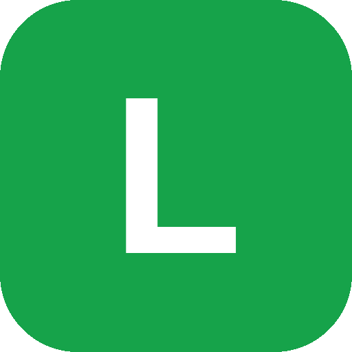

<div align="center">



# Latch

**Latch onto your real Chrome. Every agent gets its own tab group.**

Latch lets any local coding agent drive the Chrome you are already signed into — your sessions,
your cookies, your logged-in tabs. Several agents can work in that one profile at the same time
without stepping on each other, because each one's tabs are grouped and labelled with its name.

[](LICENSE)
[](https://nodejs.org)
[](https://developer.chrome.com/docs/extensions/mv3/intro/)
[](https://modelcontextprotocol.io)

</div>

---

## Why Latch

Most browser automation hands your agent a fresh, empty, logged-out browser. That is useless for the
things you actually want done — reading your analytics, checking a dashboard, finishing a form on a
site you are signed into.

Latch takes the opposite approach: **no new browser, no new profile, no re-authentication.** It
attaches to the Chrome window in front of you.

The problem with sharing one real browser is that agents collide. Latch solves that with Chrome tab
groups: every request carries the name of the agent that made it, and that name becomes the title of
a coloured tab group. Claude Code's tabs sit in a purple **Claude Code** group. Codex's sit in a cyan
**Codex** group. Yours stay where you left them, untouched.

```text
any agent (MCP or latch CLI) ──▶ Unix socket ──▶ native host ◀──▶ Chrome extension
```

Everything is local. No cloud service, no remote browser, no account.

## Features

- **Runs in your signed-in Chrome** — real sessions, real cookies, no login dance.
- **One tab group per agent, per window**, titled with the agent's name and given a stable colour.
- **Live status in the tab strip** — the group title reads `Codex · ⏳ Working`, then `Codex · ✅ Done`,
  so you can see what each agent is doing without opening anything.
- **Strict ownership** — an agent only ever reuses or adopts its *own* tabs, never another agent's
  and never your personal groups.
- **No duplicate names** — open a second Claude Code and it becomes **Claude Nova**, not a second
  **Claude Code** sharing the first one's group.
- **Reuse before opening** — `browser_open` finds a matching tab before creating a new one, so your
  window does not fill up with duplicates.
- **Scrolling that works on real apps** — when the window does not scroll, the largest scrollable
  container on screen is scrolled instead, so "scroll down" means the same thing on a blog and in a
  mail client.
- **Shadow DOM support** — snapshots, refs, selectors, scrolling, waits and typing cross open shadow
  roots, so app controls such as LinkedIn's post composer do not disappear after a click.
- **Background-first** — task tabs never steal focus unless the agent is explicitly asked to show you.
- **A visible cursor** on the page, labelled with the acting agent's name, so you can see what is
  happening and who is doing it.
- **Works with anything that speaks MCP** — Claude Code, Codex, Gemini, Cursor — plus a plain CLI for
  agents and shells that do not.
- **A small toolbar popup**: connection status, attached tab count, per-agent tab counts and live
  status, attach and detach. That is the whole UI.

## Requirements

- macOS or Linux
- Node.js 20 or newer
- Google Chrome, Chrome Beta, or Chromium
- At least one local agent (anything that speaks MCP, or any shell)

## Install

**1. Clone and install dependencies**

```bash
git clone https://github.com/freezetheworld/latch.git
cd latch
npm install
```

**2. Load the extension**

1. Open `chrome://extensions`
2. Enable **Developer mode**
3. Select **Load unpacked**
4. Choose this project's `extension/` directory

The bundled manifest key pins a stable extension ID, so the installer below needs no arguments:
`negoahcokogjggjcccibffdnognlfbkm`

**3. Install the native host**

```bash
npm run install-host
```

This writes a native-messaging manifest into Chrome's user-level config and stages the host runtime
under `~/.latch/runtime`. No administrator privileges are needed. **Restart Chrome afterwards.**

For other browsers pass `--browser chrome-beta` or `--browser chromium`. If you removed the manifest
key or repackaged the extension, pass `--extension-id YOUR_ID`.

> **macOS note:** the runtime is staged outside your checkout on purpose. Chrome's sandbox cannot
> launch a host that lives in a privacy-protected folder such as `Documents` or `Desktop`.

**4. Register the MCP server with your agents**

Use the absolute path the installer prints:

```bash
claude mcp add latch -- node /absolute/path/to/latch/server/mcp-server.js
codex  mcp add latch -- node /absolute/path/to/latch/server/mcp-server.js
gemini mcp add latch -- node /absolute/path/to/latch/server/mcp-server.js
```

Start a fresh session and run `/mcp` to confirm `latch` is active.

**5. Check it**

Click the Latch toolbar icon. It should say **Connected**. Then ask your agent something like:

```text
Open my YouTube Studio tab, check my upload defaults, and tell me what is missing.
```

## Agents and tab groups

Every request carries an agent name. That name titles the Chrome tab group holding the agent's tabs.

Resolution order:

1. an explicit `--agent NAME` flag (CLI) or `agent` parameter (MCP tool)
2. the `LATCH_AGENT` environment variable
3. auto-detection from the environment (`CLAUDECODE`, `CODEX_HOME`, `CURSOR_AGENT`, ...)
4. the neutral fallback `Agent`

```bash
# two agents driving the same Chrome profile at once
latch --agent "Claude Code" open https://example.com   # → purple "Claude Code" group
latch --agent "Codex"       open https://example.org   # → cyan "Codex" group

LATCH_AGENT="Research" latch open https://example.net
```

Known agents keep a fixed colour — Claude Code purple, Codex cyan, Gemini blue, Cursor orange,
DeepSeek green, Hermes yellow. Any other name hashes deterministically into Chrome's palette, so the
same agent always lands on the same colour.

### Two of the same agent

Two Claude Code windows both call themselves "Claude Code". Rather than pile their tabs into one
group, Latch gives the second one a callsign:

```text
Claude Code · ⏳ Working      first session
Claude Nova · ✅ Done         second session, same agent
```

The first word of the name is kept as the brand and a callsign replaces the rest, so `Codex` becomes
`Codex Vega`, `Gemini` becomes `Gemini Atlas`, and so on for any agent. Latch also steers each
variant towards a tab group colour that is not already on screen, so sessions are distinguishable by
colour as well as by name — until you have more live agents than Chrome has colours, which is nine.

This works because every request carries an opaque session id alongside the name, derived from
`$LATCH_SESSION`, then the agent's own session variable (`CLAUDE_SESSION_ID`, `CODEX_SESSION_ID`,
`CURSOR_TRACE_ID`, ...), then the terminal (`ITERM_SESSION_ID`, `TMUX_PANE`), and finally the parent
process id. It is stable across CLI invocations from the same shell, so a session keeps its name for
as long as it is in use.

### Agents are locked to their group

Separate names are not enough on their own, because attached tabs are shared state. So the tab group
is not just a label — it is the boundary an agent works inside, and Latch enforces it:

- A command with no `tabId` resolves only to an attached tab in the caller's own group. It never
  falls through to whichever tab happens to be in the foreground.
- Naming a `tabId` outside your group fails with `TAB_NOT_IN_YOUR_GROUP`, which names the owning
  agent when there is one.
- `browser_open` reuses only tabs you already own. A matching URL in the user's tabs or another
  agent's group is left alone and you get your own tab instead, so it is always safe to call.
- `browser_attach` brings a tab of the user's into your group, but is refused for a tab another live
  agent is driving. `browser_detach` and `browser_close_tab` reach only your own group.

**The group is the record of ownership**, not a map kept beside it. That has two useful
consequences. Ownership survives a service-worker restart, because it is read back off the group
title. And the user stays in charge: drag a tab from one agent's group into another's and it changes
hands; drag it out of every agent group and it is detached, because it has left every workspace.

Attaching from the toolbar popup is a person acting directly, so it takes a tab over regardless. A
tab whose owning session has been quiet for 30 minutes can be adopted by another agent through an
explicit `browser_attach` — which moves it into the new group — so an abandoned session never
strands its tabs, but no agent ever silently starts driving another's.

A name is released once its session has been quiet for 30 minutes **and** holds no attached tabs, so
the plain name comes back for the next agent instead of being locked away. `browser_status` reports
the name a caller is actually using.

### Live status

The group title is `<agent> · <emoji> <word>`, and the second half updates as the agent works:

| | | |
| --- | --- | --- |
| ⏳ Working | 🧭 Navigating | 👁️ Reading |
| 👆 Clicking | ⌨️ Typing | ⏱️ Waiting |
| ✅ Done | ⚠️ Error | 🔗 Connected |
| 💤 Idle | | |

An agent switches to the status for whichever command it is running, then settles on **✅ Done** when
that command succeeds, or **⚠️ Error** when it fails. `browser_status` and `browser_tabs` only read
extension state, so they leave the title alone.

The same emoji and word appear on the on-page cursor footer and in the toolbar popup, next to each
agent's colour swatch.

**Isolation rules**

- An agent only reuses or adopts tabs belonging to itself.
- A tab opened by an agent's tab joins that same agent's group.
- Only groups titled after an agent seen this session are adopted, so your own groups
  (`Work`, `Reading`, ...) are never taken over.

## Scrolling

Agent scrolling usually fails for one of two reasons: the agent has no idea there is more page below
the fold, or the window is not what scrolls. Latch handles both.

`browser_snapshot` reports where the page is scrolled to, and lists the scrollable containers on
screen:

```json
"scroll":     { "y": 1566, "percent": 27, "atBottom": false, "scrollsVertically": true },
"scrollers":  [ { "ref": "s1", "tag": "div", "name": "message-list", "percent": 6 } ],
"textTruncated": false
```

`browser_scroll` then moves it:

```bash
latch scroll              # one screenful down, with overlap so nothing is skipped
latch scroll bottom       # jump to the end
latch scroll --amount 400 # a specific distance
latch scroll --ref s1     # scroll one particular container
latch scroll --selector "#load-more"   # bring an element into view
```

When the window itself cannot scroll, the largest scrollable container on screen is used, so inner
panes in mail, chat, and dashboard layouts work without the agent having to work out which `div`
owns the content. A `ref` naming a scrollable container scrolls that container; a `ref` naming
anything else brings it into view.

Every call reports `movedY`, `percent`, `remaining` and `atBottom`, so an infinite feed can be walked
until it stops growing rather than guessed at. If nothing moved, the result says so instead of
looking like a successful scroll — and as a fallback for pages that hijack the wheel rather than
using a real scroll container, a genuine wheel event is sent before giving up.

## MCP tools

| Tool | Purpose |
| --- | --- |
| `browser_status` | Check the bridge and tab attachments |
| `browser_tabs` | List Chrome tabs |
| `browser_attach` / `browser_detach` | Start or stop controlling a tab |
| `browser_snapshot` | Read visible text, element refs, and scroll position |
| `browser_scroll` | Scroll the page, a container, or an element into view |
| `browser_navigate` | Navigate to a URL |
| `browser_click` / `browser_type` / `browser_press_key` | Act on page controls |
| `browser_wait_for` | Wait for a selector or text |
| `browser_screenshot` | Capture the viewport or full page |
| `browser_console` | Read console messages and JavaScript errors |
| `browser_network` | Read recent requests and response status |
| `browser_evaluate` | Run JavaScript in an attached tab |
| `browser_open` | Reuse a tab you own before creating one, inside your group |
| `browser_new_tab` / `browser_close_tab` | Force a separate tab, or close an attached one |

Every tool accepts an optional `agent` parameter.

## CLI

For agents and shells that do not speak MCP:

```bash
node cli/latch.js --help
node cli/latch.js --agent "My Agent" status
node cli/latch.js --agent "My Agent" open https://example.com
node cli/latch.js --agent "My Agent" snapshot
```

Link it onto your `PATH` if you want the bare `latch` command:

```bash
ln -s "$PWD/cli/latch.js" /usr/local/bin/latch
```

## Agent skill

`skills/latch/SKILL.md` teaches an agent the house rules: check tabs before opening, reuse before
creating, scroll with `browser_scroll` rather than `window.scrollBy`, stay in the background, never
touch another agent's group, and stop before consequential clicks.

```bash
npm run install-skill
```

That symlinks the skill into every agent installed on this machine — Claude Code, Codex, Gemini,
Cursor, and the shared `~/.agents/skills` directory other harnesses read — and puts the `latch`
command on your `PATH` at `~/.local/bin`. Because it links rather than copies, editing
`skills/latch/SKILL.md` updates every agent at once.

It only writes into config directories that already exist, so it will not create a `~/.gemini` for an
agent you do not use. Pass `--all` to install everywhere regardless, `--copy` for an agent that will
not follow a symlink, and `npm run uninstall-skill` to remove it again. Restart your agent sessions
afterwards.

## Codex plugin

This repository doubles as a Codex plugin. The manifest is `.codex-plugin/plugin.json` and its MCP
definition is `.mcp.json`. Other agents use the MCP server directly; the plugin wrapper is
Codex-specific.

## Security model

Browser automation is powerful, and page content can carry prompt injection. Latch draws hard
boundaries:

- The native host listens on a **user-only Unix socket** (`0700` directory, `0600` socket).
- Chrome accepts native messages only from the **exact extension ID** supplied at install.
- Control is scoped to tabs **explicitly attached** through the popup or `browser_attach`.
- Chrome internal pages and extension pages are **rejected**.
- Password input values are **masked** in page snapshots.
- Nothing leaves your machine. There is no server, no telemetry, no account.

Latch does **not** use macOS Screen Recording, Accessibility, AppleScript, or desktop mouse and
keyboard automation. Screenshots come from the attached tab through the Chrome DevTools Protocol.

Attached tabs may navigate across origins without extra prompts. Use a separate Chrome profile for
automation when practical, and do not attach banking, password-manager, or admin tabs unless the task
truly needs it and you are watching.

## Development

```bash
npm run verify   # syntax + JSON checks, then the test suite
npm test
```

The suite covers native-message framing, the JSON line protocol, native-host manifest generation,
runtime staging, agent-name resolution and colouring, the full local bridge end to end, and the MCP
tool interface.

```text
extension/   MV3 service worker, toolbar popup, icons
server/      native host, MCP server, agent identity, socket paths
cli/         latch command-line client
scripts/     installer and checks
skills/      agent skill definition
tests/       node:test suites
```

## Uninstall

```bash
npm run uninstall-skill
npm run uninstall-host
```

Then remove the unpacked extension at `chrome://extensions` and drop the MCP entry:

```bash
claude mcp remove latch   # and the equivalent for your other agents
```

## Troubleshooting

**Popup says Offline** — confirm the extension ID shown in the popup matches the one passed to
`install-host`, then fully quit and reopen Chrome.

**"Another debugger is attached"** — close DevTools for that tab and disable other automation
extensions.

**MCP server unavailable** — run your agent's `mcp list`, restart the session, and confirm the
absolute path to `server/mcp-server.js` still exists.

**Nothing happens on a page** — the tab must be attached. Click the Latch icon and press **Attach**,
or have the agent call `browser_attach`.

## Contributing

Issues and pull requests are welcome. Please run `npm run verify` before opening a PR.

## License

[MIT](LICENSE)
